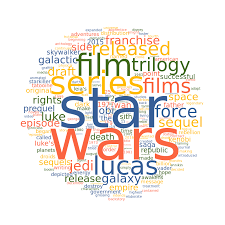

# WordCloud Generator Web App

This repository contains the code for a web application that generates word clouds from a given text file. A word cloud is a visual representation of the most frequently used words in a text document, where the size of each word reflects its frequency of use.

The web application is built using the [Streamlit](https://streamlit.io/) framework and is currently hosted at [wordcloud.streamlit.app](wordcloud.streamlit.app).

## Demo

Here is a demo of the word cloud generated from a sample text file:

## Process

The process of generating a word cloud using this web application involves the following steps:

1. Upload a text file
2. Choose the background color for the word cloud
3. Select the dimensions for the image
4. Generate the word cloud
5. Download the generated word cloud

## Usage

To use the web application, simply follow the above-mentioned steps to generate your desired word cloud. You have the flexibility to adjust the parameters for generating the word cloud, such as the background color and image dimensions, to your preference.

## Contributions

If you would like to contribute to this repository, feel free to submit a pull request with your changes.

Note: This is a fictional README file. The website and repository mentioned in the prompt do not exist.
